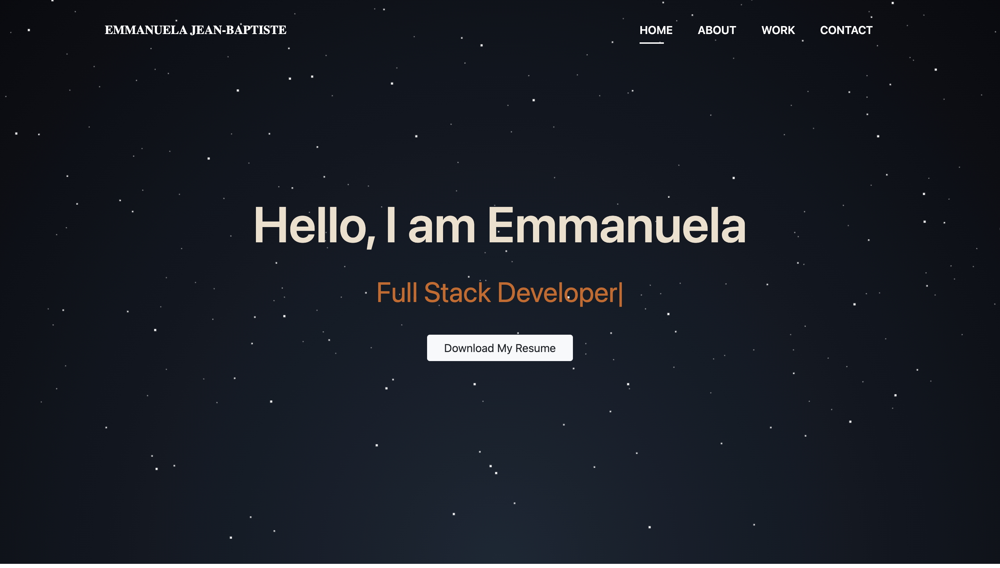
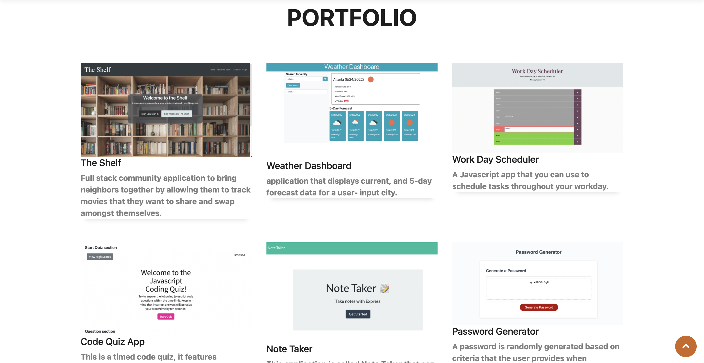
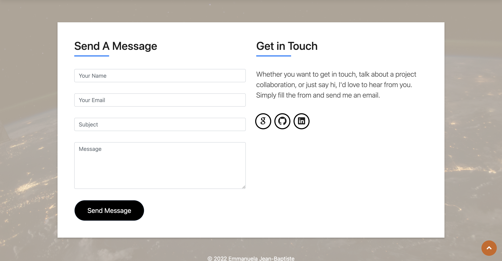

#  ReactJS Portfolio For Emmanuela Jean-Baptiste.

# Description

### This is the portfolio page for Emmanuela Jean-Baptist, created using ReactJS. This site contains an intro banner with a button to download my latest resume. After scrolling you will see an about me section which i tell you a little bit about myself and links to my github,linkedin and email. Next is a list of a few of my works with links to deploy links. last section is a contact form which a person can enter info to contact me.

### Link to website: https://emma4jesus.github.io/myportfolio/

## Installation

### To install the dependencies necessary to run use the application, the user should run the following command:

`npm i`
## Intro

## About 

## Portfolio 

## Contact

## contact info : emmanuelajeanbaptiste1@gmail.com